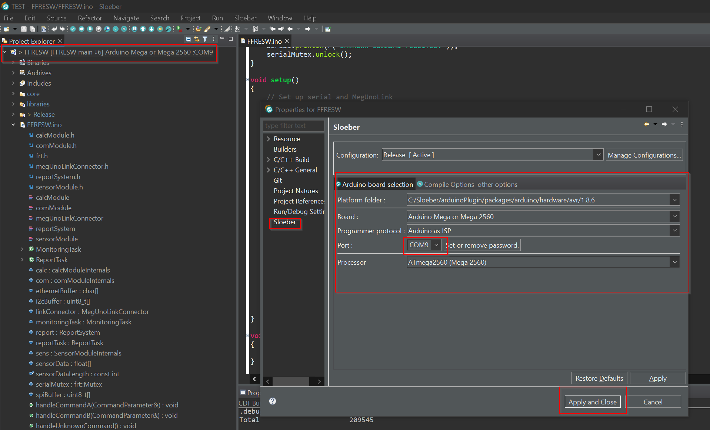

# FFRESW

## Overview

This is the embedded software for the FFRESW project

## Getting Started

### Build Steps

**1.** Clone the repository:
```bash
git clone https://github.com/mendax0110/FFRESW
cd FFRESW
```
**2.** Init submodule:
````bash
git submodule update --init --recursive
````

**3.** Run the copy_ErriezMemoryUsage.bat file
```bash	
cd utils
copy_ErriezMemoryUsage.bat
```

**4.** Arduino Version 1.8.13

**5.** Install these Libraries Sketch > Include Library > Manage Libraries.
- FreeRTOS
- frt
- ArduinoJson

**6.** Error MemoryFree --> add this to User


**7.** Download Sloeber
- https://eclipse.baeyens.it/stable.php?OS=Windows

**8.** Install Sloeber
- https://eclipse.baeyens.it/how_to.shtml

**9.** Start Sloeber


**8.** IDE and Compiler Settings



