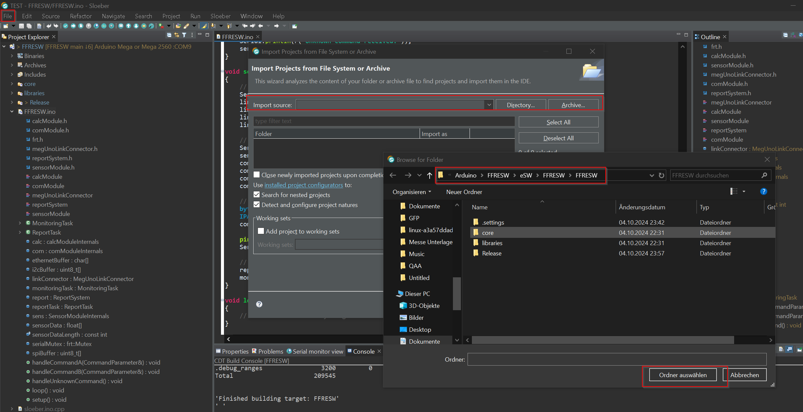

# FFRESW

## Overview

This project utilizes the [Arduino-MemoryFree](https://github.com/mpflaga/Arduino-MemoryFree) library to monitor memory usage in Arduino sketches. To get started, please follow the instructions below.

## Prerequisites

- You need to have the [Programino IDE](https://www.programino.com/) installed on your machine.

## Getting Started

### Build Steps

**1.** Clone the repository:
```bash
git clone https://github.com/mendax0110/FFRESW
cd FFRESW
```

**2.** Run the copy_memory_free.bat file
```bash	
cd utils
copy_memory_free.bat
```

**3.** Open the main.ino file in the Programino IDE.

**4.** IDE and Compiler Settings



